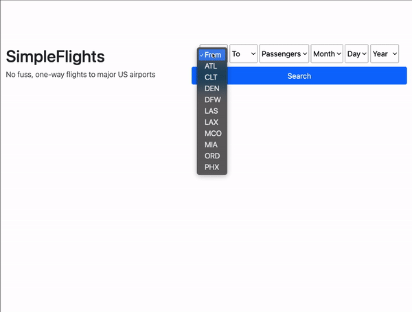

# Simple Flights

A website that simulate's an airline's flight booker.

See a live version of this webiste [here](http://www.simple-flights.com/).

## Demo



## Features

* Users can book a one-way flight from and to 10 major US airports
* Users can select a specific flight to book out of the flights that meet the user's search criteria
* Users can search for flights by date, departure airport, and arrival airport
* Booking form can handle booking flights for 1-4 passengers at once
* Confirmation page confirms flights are successfully booked and displays all passengers' names and emails
* Form validation provides feedback to the user if invalid or incomplete data is entered into the search and booking forms

## How to Use

To view the live site, go [here](http://www.simple-flights.com/).

To run locally, you must have [Ruby](https://www.ruby-lang.org/en/downloads/) and [Ruby on Rails](https://guides.rubyonrails.org/v5.0/getting_started.html) installed. This application was written with Ruby 3.1 and Ruby on Rails 7.

If you have Ruby and Ruby on Rails installed, clone this repo:
```
$ git clone git@github.com:kathleenmoran/simple-flights.git
```

Install the required gems:
```
$ bundle install
```

Migrate the database:
```
$ rails db:migrate
```

Seed the database (NOTE: This may take a few moments because it is seeding the database with a year's worth of flight data):
```
$ rails db:seed
```

Run a local server:
```
$ rails server
```

Finally, navigate to `localhost:3000` in your browser.

## Style Guide

Written with the community [ruby style guide](https://rubystyle.guide/).

## Future Improvements

* Send confirmation emails to passengers who have booked flights
* Allow users to look up bookings
* Use JavaScript to require search form to be completely filled out before submitting
* Allow user to dynamically add and remove passengers from the booking form

## Gratitudes

This project is based off of an assignment from [The Odin Project](https://www.theodinproject.com/lessons/ruby-on-rails-flight-booker). Inspiration for the layout of this README was drawn from [ChargrilledChook's READMEs](https://github.com/ChargrilledChook).